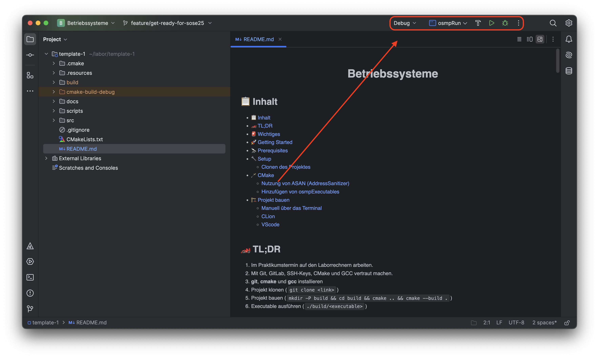
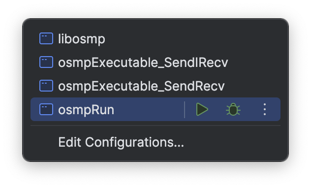
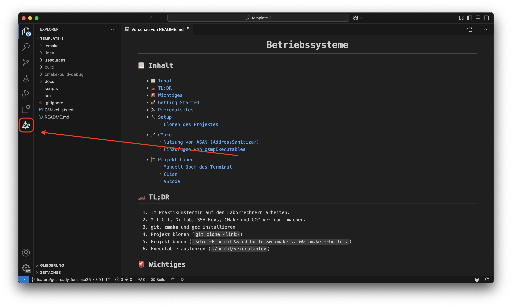
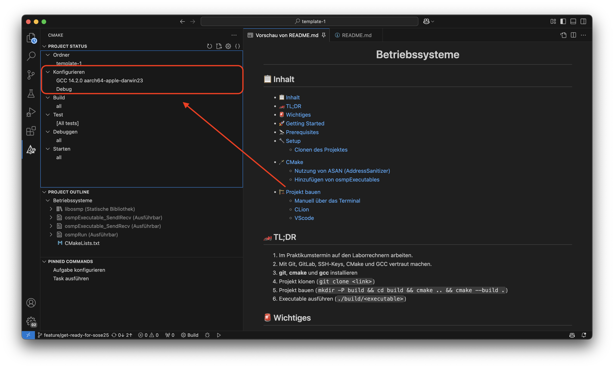
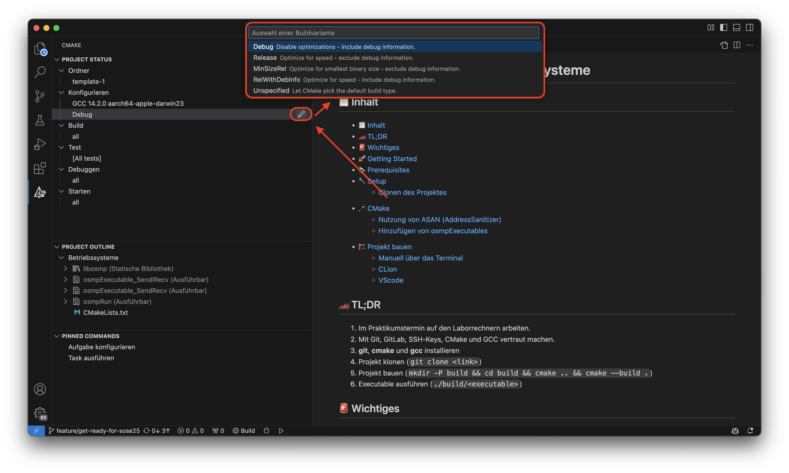
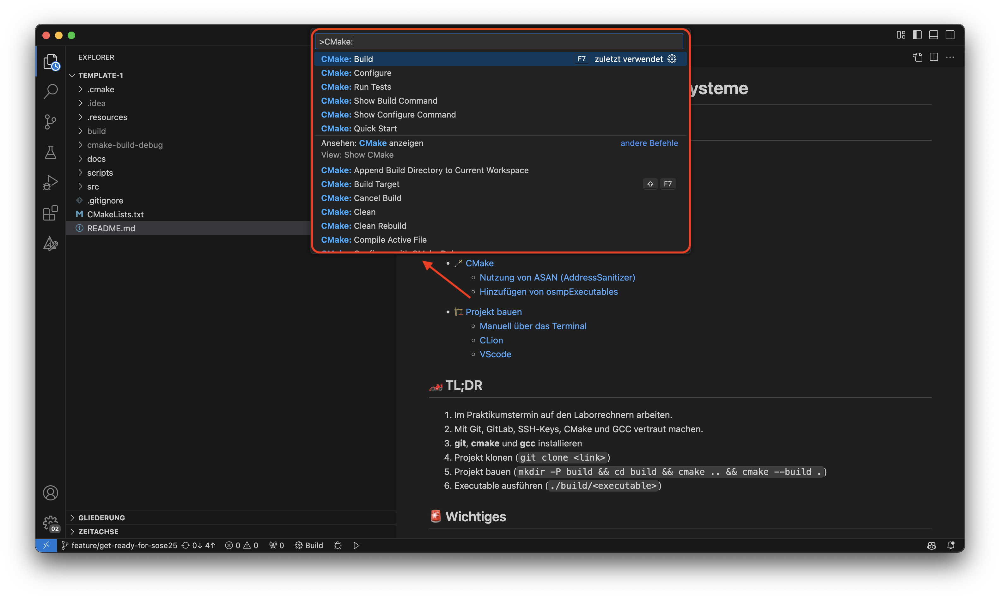

<div align="center">

# Betriebssysteme

</div>

## 📋 Inhalt

- [📋 Inhalt](#-inhalt)
- [🏎️ TL;DR](#️-tldr)
- [🚨 Wichtiges](#-wichtiges)
- [🚀 Getting Started](#-getting-started)
- [🔭 Prerequisites](#-prerequisites)
  - [Git](#git)
  - [CMake und GCC](#cmake-und-gcc)
- [🔧 Setup](#-setup)
  - [SSH Keys](#ssh-keys)
  - [Clonen des Projektes](#clonen-des-projektes)
  - [Anfangen zu arbeiten](#anfangen-zu-arbeiten)
- [🪄 CMake](#-cmake)
  - [Nutzung von ASAN (AddressSanitizer)](#nutzung-von-asan-addresssanitizer)
  - [Hinzufügen von osmpExecutables](#hinzufügen-von-osmpexecutables)
- [🏗️ Projekt bauen](#️-projekt-bauen)
  - [Manuell über das Terminal](#manuell-über-das-terminal)
  - [CLion](#clion)
  - [VScode](#vscode)

## 🏎️ TL;DR

1. Im Praktikumstermin auf den Laborrechnern arbeiten.
2. Sie können nicht auf die Laborrechner zugreifen.
3. Das Projekt muss auf den Laborrechnern fehlerfrei kompilieren und laufen.
4. Mit Git, GitLab, SSH-Keys, CMake und GCC vertraut machen.
5. **git**, **cmake** und **gcc** installieren
6. Projekt klonen (`git clone <link>`)
7. In das Projektverzeichnis wechseln (`cd <projektordner>`)
8. Projekt bauen (`cmake -S . -B build -D CMAKE_VERBOSE_MAKEFILE=ON && cmake --build .`)
9. Executable ausführen (`./build/<executable>`)

## 🚨 Wichtiges

Obwohl Sie sich mit Ihrer FH-Kennung auch an unseren Rechnern mit dem gewohnten Passwort anmelden können, verwenden wir eigene Homeverzeichnisse, die von eigenen Servern gemountet werden.
Deswegen sind Ihre Dateien nur auf den Betriebssystem-Laborrechnern verfügbar und nicht auf den von anderen Laboren.

Unser Labornetz ist zudem **nicht** von außen nutzbar.
Sorgen Sie also bitte dafür, dass Sie Ihre Dateien zum Ende des Praktikums in Ihrem Git-Repository ablegen.

## 🚀 Getting Started

Auf unseren Laborrechnern ist aktuell Ubuntu 22.04 LTS installiert. Wir
erwarten, dass Ihr Praktikumsprojekt:

- auf diesen Rechnern **fehlerfrei kompiliert**
- und zum Abschluss **fehlerfrei funktioniert**.

Unsere Laborrechner sind für das Praktikum vorbereitet und enthalten
insbesondere von uns geforderte Programme. Zu Beginn sind jedoch einige
persönliche Einstellungen noch zu erledigen, die unter dem Punkt [Setup](#setup)
besprochen werden.

## 🔭 Prerequisites

### Git

Um dieses Projekt lokal zu nutzen, wird Git benötigt, da es uns ermöglicht,
den gesamten Projektcode von GitLab zu klonen/kopieren und Änderungen mit dem
Stand im GitLab zu synchronisieren.

```sh
sudo apt install git
```

Dokumentation, wie Git verwendet wrid bzw. wie das repo geklont werden kann.

### CMake und GCC

Um das Praktikumsprojekt bauen zu können, müssen Sie cmake und gcc installiert haben.

```sh
sudo apt install -y cmake gcc
```

## 🔧 Setup

Stellen Sie sicher, dass Sie alle [prerequisites](#-prerequisites) installiert haben.

Die Versionierung des Praktikums geschieht über das GitLab der FH-Münster.
Um lokal auf einem Rechner an dem Projekt weiterzuentwickeln, muss das Projekt lokal auf den Rechner kopiert werden.

Hilfreich, um git/gitlab kennenzulernen:

- [https://git.fh-muenster.de/help/topics/git/get_started.md](https://git.fh-muenster.de/help/topics/git/get_started.md)
- [https://about.gitlab.com/images/press/git-cheat-sheet.pdf](https://about.gitlab.com/images/press/git-cheat-sheet.pdf)

### SSH Keys

Um Ihr Leben zu erleichtern, sollten Sie ein SSH-Key für GitLab erstellen.
Damit müssen Sie nicht jedes Mal Ihr Passwort eingeben, wenn Sie ein Repository klonen oder aktualisieren.
Dazu finden Sie [hier](https://docs.gitlab.com/ee/user/ssh.html) eine Anleitung, wie Sie ein SSH-Key für das GitLab erstellen.

### Clonen des Projektes

```sh
cd my-folder
git clone ssh://git@git.fh-muenster.de:2323/<link-zum-projekt>.git
cd <projektordner>
```

### Anfangen zu arbeiten

Nachdem Sie das Projekt geklont haben, können Sie anfangen zu arbeiten.
Sie können dieses Repository **vollständig** bearbeiten und anpassen.
Als einzige Bedingung gilt, dass Sie die Struktur des Projektes beibehalten, also die Ordner

- `osmpExecutables` für die OSMP-Executables
- `osmpRunner` für den OSMP-Runner
- `osmpLibrary` für die OSMP-Library

verwenden.
Ansonsten können Sie das Projekt nach Ihren Wünschen anpassen!

**Beispielsweise** können Sie den Parser für die OSMP-Runner Argumente in eine eigene Datei auslagern und dann im osmpRunner über ein `#include "parser.h"` einbinden.

## 🪄 CMake

CMake ist ein Build-System-Generator.
Es erstellt aus einer CMake-Datei (CMakeLists.txt) ein Build-System, das dann genutzt werden kann, um das Projekt zu bauen.

### Nutzung von ASAN (AddressSanitizer)

Sie haben die Möglichkeit, den [AddressSanitizer](https://github.com/google/sanitizers/wiki/addresssanitizer) (ASAN) zu nutzen, um Speicherfehler zu finden.
ASAN ist ein Werkzeug, das in modernen GCC- und Clang-Compilern enthalten ist.
Es kann verwendet werden, um Speicherfehler wie Buffer Overflows, Undefiniertes Verhalten und Speicherlecks zu finden.

```cmake title="CMakeLists.txt"
#== ASAN ==#
# Ändern Sie den Wert von "OFF" zu "ON", um AddressSanitizer zu aktivieren
option(USE_ASAN "AddressSanitizer aktivieren" OFF)
compile_with_asan(${USE_ASAN})
```

Um ASAN zu nutzen, müssen Sie die CMake-Variable `USE_ASAN` auf `ON` setzen.

Dazu können Sie entweder die Variable in der CMakeLists.txt setzen oder beim Aufruf von CMake die Variable setzen (z. B. `cmake -DUSE_ASAN=ON ...`).

### Hinzufügen von osmpExecutables

Um eine Executable hinzuzufügen, muss die [CMakeLists.txt](./CMakeLists.txt) bearbeitet werden. Hier finden Sie folgende Zeilen:

```cmake title="CMakeLists.txt"
#== Executables ==#
set(EXECUTABLES
    NAME osmpRun
    SOURCES src/osmp_runner/osmp_run.c src/osmp_runner/osmp_run.h
    NAME echoAll
    SOURCES src/osmpExecutables/echoAll.c
    # Neue Executables hier einfügen
    # NAME <name>
    # SOURCES <source1> <source2> ...
)
```

Hier müssen Sie den

- **NAME** (Der Name Executable) und die
- **SOURCES** (Die benötigten source-Dateien Leerzeichen separiert)

in folgendem Format hinzufügen:

```cmake
NAME <Name der Executable>
SOURCES <Source-Dateien>
```

Über den Namen steuern Sie, wie die ausführbare Datei heißt.
Diese Datei werden Sie dann in dem build Ordner finden (z. B. "build", "cmake-build-debug" oder "cmake-build-release").

## 🏗️ Projekt bauen

Das Projekt wird mit CMake gebaut. Sie können die IDE frei wählen.

### Manuell über das Terminal

Das Projekt lässt sich wie folgt manuell per CMake bauen

CMake: [https://cmake.org/getting-started/](https://cmake.org/getting-started/)

```sh
cd /pfad/zum/projektordner

# Konfigurieren des Projekts
cmake -S . -B build -D CMAKE_VERBOSE_MAKEFILE=ON

# Bauen der Binaries
cmake --build build
```

### CLion

Nachdem Sie das Projekt in CLion geöffnet haben, sehen sie oben rechts folgendes:

{ width=500px }

Hier können Sie, indem Sie auf `osmpRun` klicke, die Executable auswählen, die Sie bauen möchten.

{ width=500px }

### VScode

Installieren Sie folgende Extensions:

- C/C++ Extension Pack

Gehen Sie in die Kommando-Palette (CMD/CTRL + SHIFT + P) und suchen Sie nach
`CMake: Konfigurieren`. Hier wählen Sie die entsprechende CMakeLists.txt Datei
aus.

Nun können Sie auf die CMake Extension (in dem Linken Reiter) gehen.

{ width=500px }

Jetzt sollten Sie etwas ähnliches zu dem folgenden Bild sehen.

{ width=500px }

Hier können Sie bei `Debug` die Build-Variante konfigurieren

{ width=500px }

Und nun können Sie in der Kommando-Palette mit `CMake: Build` die Executables bauen.

{ width=500px }

<div align="right" style="text-align: right">

[(nach oben)](#betriebssysteme)

</div>
